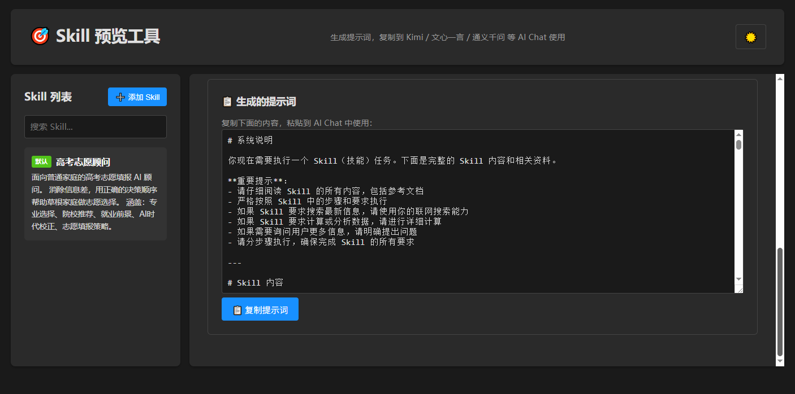
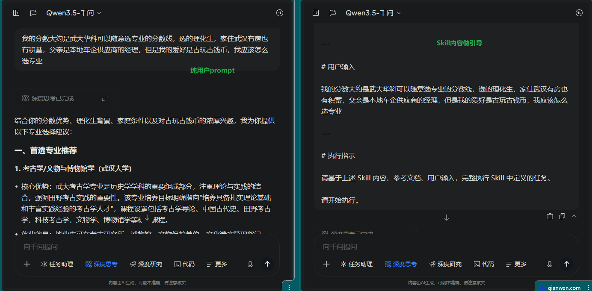
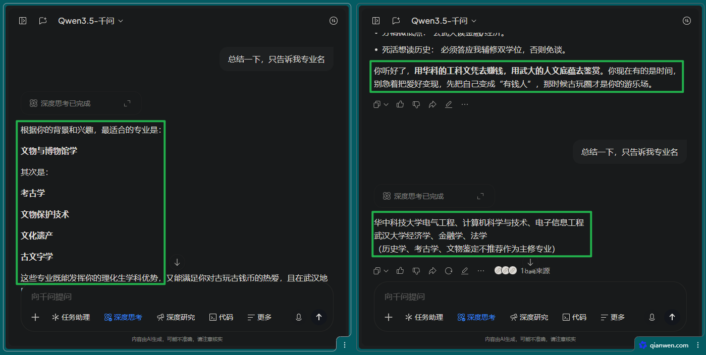

<div align="center">

# 🌍 EverySkill

### *Agent 不是你需要的，Skill 才是*

**打通专业 AI 技能与免费 Chat 的最后一公里**

---

你有没有想过，为什么那些付费 AI 工具看起来"更聪明"？  
不是因为模型更好，而是因为它们有**专业的 Skill（技能包）**。

现在，**每个人**都可以拥有。

[](https://github.com/SPA3K/EverySkill)
[](LICENSE)
[](skill-preview-tool.html)

**📖 [快速开始](#-快速开始) | 🎬 [3分钟上手](#-使用流程图文演示) | 💡 [看看效果](#-使用示例) | ❓ [常见问题](#-常见问题)**

</div>

---

## 💥 一句话说清楚

**EverySkill** 把专业 AI 工具的 Skill（技能包）转换成提示词模板，让 Kimi、文心一言、通义千问等**免费 AI Chat** 也能拥有专业级能力。

> 🎯 **核心理念**：Agent 很强大，但它是专业开发者的工具。普通用户真正需要的，是那些经过验证的、可复用的 **Skill**。

### 🎓 已内置张雪峰老师选专业 Skill

**EverySkill** 已经集成了 [**张雪峰老师的选专业 Skillset**](https://github.com/Eric-Yibo-Shen/zhangxuefeng-skillset)！

现在你可以用免费 AI：
- 🎯 根据分数和兴趣，获得专业的选专业建议
- 📊 分析不同专业的就业前景和发展方向
- 💼 了解专业对应的职业路径

**更棒的是**：你可以添加**任何名人**的 Skill！
- 🎤 罗永浩的产品思维？
- 💰 巴菲特的投资理念？
- 🎨 乔布斯的设计哲学？

只要有人把他们的方法论整理成 Skill 包，EverySkill 就能让免费 AI 为你提供"名人级"的咨询！

---

## 🤔 为什么是 Skill，而不是 Agent？

|  | Agent（智能体） | Skill（技能包） |
|---|---|---|
| **定位** | 复杂的自主决策系统 | 专注的单一能力模块 |
| **使用门槛** | 需要配置、调试、理解工作流 | 即插即用，一键生成 |
| **成本** | 通常需要付费 API 或订阅 | 免费 AI Chat 就能用 |
| **学习曲线** | 陡峭（需要理解 Agent 框架） | 平缓（只需复制粘贴） |
| **适用场景** | 企业级、开发者、复杂任务 | 日常使用、快速解决问题 |

**简单来说**：
- ❌ Agent 是一辆豪华跑车 - 强大但需要驾照和维护
- ✅ Skill 是一辆共享单车 - 简单但够用，随时可骑

---

## 🎯 解决什么问题？

### 😫 你可能遇到过这些情况

1. **"这个 AI 工具的 XX 功能真好用，可是要付费..."**
   - ✅ EverySkill：把付费工具的 Skill 转成免费 AI 也能用的提示词

2. **"我不知道怎么写提示词让 AI 做专业的代码审查..."**
   - ✅ EverySkill：内置几十个专业 Skill，一键生成标准提示词

3. **"每次都要重新描述需求，太麻烦了..."**
   - ✅ EverySkill：Skill 就是可复用的提示词模板，填空即用

4. **"AI 回答太泛泛，不够专业..."**
   - ✅ EverySkill：Skill 包含角色定义、执行标准、输出格式，保证质量

### 🎁 你将获得什么

- 🆓 **零成本体验专业能力**：不用订阅付费工具
- ⚡ **即学即用**：3 分钟上手，无需配置
- 🎨 **丰富的 Skill 库**：代码审查、Git 提交、TDD、架构设计、**张雪峰选专业**...
- 🌟 **名人 Skill 扩展**：自己添加任何名人的方法论和思维模式
- 🔒 **隐私安全**：完全离线，数据不上传
- 📱 **随时随地**：单 HTML 文件，手机电脑都能用

---

## ✨ 它是如何工作的？

```
┌─────────────────┐      ┌──────────────┐      ┌─────────────────┐
│ 专业 Skill 包   │ ───▶ │ EverySkill  │ ───▶ │ 标准提示词模板  │
│ (技能包)        │      │ (一键转换)   │      │ (复制粘贴)       │
└─────────────────┘      └──────────────┘      └─────────────────┘
                                                         │
                                                         ▼
                                               ┌─────────────────┐
                                               │ 免费 AI Chat    │
                                               │ (Kimi/通义/文心) │
                                               └─────────────────┘
```

**3 步走：**
1. 📦 选择一个 Skill（比如 `code-reviewer` 代码审查）
2. ✍️ 填写你的需求（比如"审查这段 Python 代码的安全性"）
3. 🚀 生成提示词，粘贴到任何免费 AI Chat 使用

---

## 🚀 快速开始

### 1️⃣ 下载

```bash
# 克隆仓库
git clone https://github.com/SPA3K/EverySkill.git

# 或直接下载单文件（推荐）
wget https://raw.githubusercontent.com/SPA3K/EverySkill/main/everyskill.html
```

### 2️⃣ 打开

双击 `everyskill.html` 文件，或在浏览器中打开：
```
file:///path/to/everyskill.html
```

### 3️⃣ 使用

1. 左侧选择 Skill
2. 右侧填写需求
3. 点击生成，复制提示词
4. 粘贴到免费 AI Chat

**就这么简单！** 🎉

---

## 🎬 使用流程（图文演示）

### 💡 核心价值：让免费 AI 获得专业级能力

#### 步骤 1️⃣：打开工具，选择 Skill


*👆 清爽的界面 - 左侧是 Skill 库，右侧是你的工作台*

#### 步骤 2️⃣：填写需求，生成提示词


*👆 **关键对比**：左边是你随便写的几句话，右边是生成的专业提示词模板*

你只需要：
- ✍️ 简单描述需求（不用很专业）
- 📎 可选：上传相关文件（代码、配置等）

EverySkill 自动生成：
- ✅ 专业角色定义
- ✅ 详细执行指示
- ✅ 结构化输出格式
- ✅ 质量控制标准

#### 步骤 3️⃣：复制粘贴到免费 AI Chat


*👆 在通义千问中使用 - AI 按照 Skill 给出专业的结构化建议*

**效果惊人**：
- ❌ 不用 Skill：AI 给出笼统的、不专业的回答
- ✅ 用 EverySkill：AI 秒变专家，输出专业、结构化、可执行

---

## 📖 使用示例

### 🔍 示例 1：代码审查（让免费 AI 成为你的 Code Reviewer）

**选择 Skill**：`code-reviewer`

**填写需求**：
```
项目：Python Flask API
关注点：安全性、性能、代码规范
```

**上传文件**：`app.py`、`requirements.txt`

**生成提示词** → 粘贴到 Kimi/文心一言/通义千问

**结果**：AI 会像资深工程师一样，给出：
- 🔒 安全漏洞分析（SQL 注入、XSS 等）
- ⚡ 性能优化建议（查询优化、缓存策略）
- 📏 代码规范问题（PEP8、命名、结构）
- ✅ 修改建议和示例代码

**价值**：原本需要 GitHub Copilot 或 CodeRabbit 的专业审查，现在免费 AI 就能做！

---

### 💬 示例 2：Git 提交信息（告别"update"、"fix bug"）

**选择 Skill**：`commit`

**填写需求**：
```
改动：
- 修复用户登录 SQL 注入漏洞
- 添加参数验证
- 更新单元测试
```

**生成提示词** → 粘贴到任意 AI Chat

**结果**：AI 生成符合 Conventional Commits 规范的提交信息：
```
fix(auth): prevent SQL injection in login endpoint

- Add parameterized queries for user authentication
- Implement input validation for username/password
- Update auth tests to cover injection scenarios

BREAKING CHANGE: Login API now requires Content-Type header
```

**价值**：专业的 Git 规范，不用记格式，AI 帮你写！

---

### 🧪 示例 3：TDD 开发（测试驱动开发指导）

**选择 Skill**：`tdd-guide`

**填写需求**：
```
功能：购物车系统
- 添加商品
- 修改数量
- 计算总价
- 应用优惠券

语言：Python
框架：pytest
```

**生成提示词** → 粘贴到 AI Chat

**结果**：AI 成为你的 TDD 教练，给出：
1. 📝 测试用例设计（Red 阶段）
2. ✅ 实现代码（Green 阶段）
3. 🔧 重构建议（Refactor 阶段）
4. 🎯 边界条件和异常处理

**价值**：企业级开发流程，免费 AI 当你的技术导师！

---

### 🎓 示例 4：张雪峰选专业（高考志愿填报神器）

**选择 Skill**：`zhangxuefeng-major-advisor`（已内置）

**填写需求**：
```
高考分数：580 分
省份：山东
科类：理科
兴趣方向：计算机、金融
家庭期望：就业优先，考虑考研
```

**生成提示词** → 粘贴到任意 AI Chat

**结果**：AI 会像张雪峰老师一样，给出：
- 🎯 适合的专业推荐（按录取概率排序）
- 📊 专业的就业前景分析（薪资、行业趋势）
- 🏫 推荐的学校和城市（考虑地域优势）
- 💡 专业选择的注意事项（避坑指南）
- 🔮 未来发展路径（本科就业 vs 考研深造）

**价值**：专业的高考咨询原本要花几千块，现在免费 AI 就能提供张雪峰式的建议！

**扩展玩法**：
- 你可以制作"罗翔老师的法律 Skill"
- 你可以制作"李永乐老师的数学 Skill"
- 你可以制作"巴菲特的投资 Skill"
- **任何名人的方法论，都能变成你的免费 AI 顾问！**

---

## 🎨 界面预览


**界面说明：**
- **左侧**：Skill 库，可搜索、筛选、添加自定义
- **右侧**：参数填写区，支持文件上传
- **底部**：生成的提示词，一键复制
- **顶部**：主题切换（深色/浅色）

---

## 🛠️ 技术特点

- 🎯 **单文件设计**：一个 HTML 文件包含所有功能
- 📦 **完全离线**：首次加载后无需联网
- 💾 **本地存储**：所有数据存在浏览器，不上传服务器
- 🎨 **现代 UI**：响应式布局，支持移动端
- ⚡ **极速加载**：无后端依赖，秒开
- 🔒 **隐私安全**：开源可审计，数据不外泄

### 技术栈
- 纯前端：HTML5 + CSS3 + Vanilla JavaScript
- 依赖库（CDN）：JSZip、js-yaml、marked
- 存储：LocalStorage

---

## 📚 Skill 格式

支持标准的 Claude Code Skill 格式（.zip 包）：

```
your-skill.zip
├── skill.md          # 必需：Skill 主文件
├── icon.svg          # 可选：图标
└── additional/       # 可选：其他资源
```

### skill.md 示例

```markdown
---
name: my-skill
description: 这是一个很棒的技能
version: 1.0.0
---

你是一个专业的 {{role}}。

## 任务
{{user_input}}

## 输出格式
1. 分析
2. 建议
3. 代码
```

---

## ❓ 常见问题

### Q1: 为什么是 Skill 而不是 Agent？

**A:** Agent 是复杂的自主系统，需要配置、调试、理解工作流，通常还需要付费。Skill 是专注的能力模块，即插即用，免费 AI Chat 就能用。对于 99% 的日常任务，Skill 已经足够，且更简单。

### Q2: 和 ChatGPT 的 GPTs 有什么区别？

**A:** 
- GPTs 需要 ChatGPT Plus（$20/月），且只能在 ChatGPT 用
- EverySkill 完全免费，生成的提示词可以在任何 AI Chat 使用

### Q3: 需要联网吗？

**A:** 
- 首次加载需要下载依赖库
- 之后完全离线可用

### Q4: 支持哪些 AI？

**A:** 任何支持文本输入的 AI Chat：
- ✅ Kimi（月之暗面）
- ✅ 文心一言（百度）
- ✅ 通义千问（阿里）
- ✅ 豆包（字节）
- ✅ ChatGPT（OpenAI）
- ✅ Claude（Anthropic）
- ✅ 其他任何 LLM

### Q5: 数据安全吗？

**A:** 
- ✅ 数据存储在浏览器本地
- ✅ 不上传任何内容到服务器
- ✅ 开源代码可审计
- ✅ 可完全离线使用

### Q6: 如何添加新 Skill？

**A:** 两种方式：
1. **上传现成的**：点击"➕ 添加 Skill"，上传 .zip 包
2. **自己制作**：参考 [张雪峰 Skillset](https://github.com/Eric-Yibo-Shen/zhangxuefeng-skillset) 的格式，制作任何名人的 Skill

### Q7: 可以添加哪些名人的 Skill？

**A:** 任何有明确方法论的名人都可以！例如：
- 📚 **教育类**：张雪峰（选专业）、李永乐（数学）、罗翔（法律）
- 💼 **商业类**：雷军（产品）、罗永浩（营销）、董明珠（管理）
- 💰 **投资类**：巴菲特（价值投资）、芒格（思维模型）
- 🎨 **设计类**：乔布斯（产品设计）、原研哉（美学）
- 🏋️ **生活类**：刘畊宏（健身）、李子柒（生活美学）

只要把他们的思维方式和方法论整理成 Skill 格式，就能让免费 AI 提供"名人级"建议！

---

## 🗺️ 路线图

- [x] **v1.0** - 基础功能
  - [x] Skill 解析和显示
  - [x] 提示词生成
  - [x] 本地存储
  
- [ ] **v1.1** - 增强体验
  - [ ] Skill 编辑器
  - [ ] 历史记录
  - [ ] 一键分享
  
- [ ] **v1.2** - 生态建设
  - [ ] 官方 Skill 市场
  - [ ] 社区投票评分
  - [ ] Chrome/Firefox 扩展
  
- [ ] **v2.0** - 平台化
  - [ ] 多 AI 平台优化
  - [ ] API 接口
  - [ ] 桌面应用

---

## 🤝 贡献

欢迎贡献 Skill 或改进代码！

1. Fork 仓库
2. 创建分支：`git checkout -b feature/AmazingFeature`
3. 提交改动：`git commit -m 'Add AmazingFeature'`
4. 推送分支：`git push origin feature/AmazingFeature`
5. 提交 Pull Request

---

## 📄 许可证

MIT License - 自由使用、修改、分发

---

## 🙏 致谢

- [JSZip](https://stuk.github.io/jszip/) - ZIP 文件处理
- [js-yaml](https://github.com/nodeca/js-yaml) - YAML 解析
- [marked](https://marked.js.org/) - Markdown 渲染
- [张雪峰老师选专业 Skillset](https://github.com/Eric-Yibo-Shen/zhangxuefeng-skillset) - 首个名人 Skill 示例
- 所有贡献 Skill 的开发者

---

<div align="center">

## 🌍 EverySkill

**Agent 不是你需要的，Skill 才是**

打通专业 AI 技能与免费 Chat 的最后一公里

---

Made with ❤️ for everyone | 让 AI 能力真正普惠

[⭐ Star](https://github.com/SPA3K/EverySkill) | [🐛 Report Bug](https://github.com/SPA3K/EverySkill/issues) | [💡 Request Feature](https://github.com/SPA3K/EverySkill/issues)

</div>
